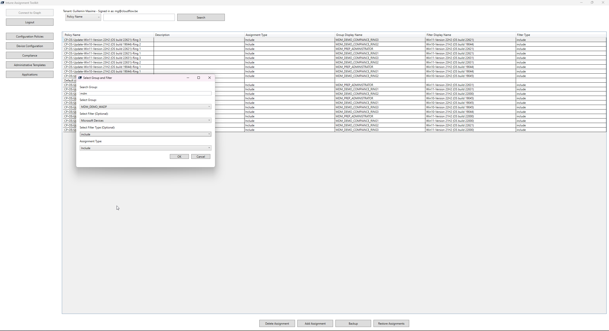

# Intune Toolkit

## Overview

The Intune Toolkit is a PowerShell-based solution designed to simplify the management of Microsoft Intune policies. It provides a user-friendly interface for connecting to Microsoft Graph, managing policy assignments, and handling backup and restore operations for these assignments. The toolkit focuses on functionalities such as backing up and restoring policy assignments, and adding or deleting assignments, with robust error handling and detailed logging.



## Features

- **Connect to Microsoft Graph:** Authenticate with necessary scopes.
- **Connect to Microsoft Graph With Enterprise App:** Authenticate with necessary scopes.
- **Tenant Information:** Display tenant details and signed-in user information.
- **Policy and App Management:** View and manage policies and apps with their assignments.
- **Supported Assignments:**
  - Configuration Policies
  - Device Configuration Policies
  - Device Compliance Policies
  - Mobile Applications
    - Windows Applications
    - MacOS Applications
    - Android Managed Google Playstore Applications
    - IOS Store Applications
  - App Configuration Policies
  - Administrative Templates
  - Platform Scripts
  - Mac OS Scripts
- **Assignment Management:**
  - Add and delete assignments for selected policies.
  - Search Security Groups.
  - Support for filters and installation intent.
- **Backup and Restore:**
  - Back up and restore assignments to policies and apps.
- **Export Assignments:**
  - Export assignments to CSV

  - Document Assignments to Markdown File
    - Selected Policies / applications
    - Bulk Export of Policy Type
- **Edit DisplayName & Description:** Easely eddit your policy/app names and descriptions
- **Refresh:** Update and Refresh your security groups and policies/apps
- **Logging:** Detailed logging for all major actions and error handling.

## Prerequisites

- PowerShell 7.0 or later.
- Microsoft Graph PowerShell SDK.
- Windows Presentation Framework (WPF) for the GUI components.
- Access to Microsoft Intune with the necessary permissions.
- Ms Graph Permissions
  - `User.Read.All`
  - `Directory.Read.All`
  - `DeviceManagementConfiguration.ReadWrite.All`
  - `DeviceManagementApps.ReadWrite.All`

## Installation

1. Clone the repository:
    ```sh
    git clone https://github.com/yourusername/Intune-Toolkit.git
    cd Intune-Toolkit
    ```

2. Ensure you have the required assemblies and permissions to run the toolkit.

## Usage

1. **Launch the Main Script:**
    ```sh
    .\Main.ps1
    ```

2. **Connect to Microsoft Graph:**
    - Click the "Connect" button to sign in and authorize the toolkit with the necessary scopes.

3. **Manage Policies:**
    - Select the type of policy you want to manage (e.g., Configuration Policies, Device Compliance Policies, etc.) using the corresponding buttons.
    - View and manage the assignments for the selected policies.

4. **Backup Policies:**
    - Click the "Backup" button to save the current assignments of your policies to a JSON file. Note that the toolkit currently supports only bulk backups; individual policy backups will be available in future updates.

5. **Restore Policies:**
    - Click the "Restore" button to load all assignments of the selected policy type from a backup file. Note that individual policy restores will be available in future updates.

6. **Add/Remove Assignments:**
    - Use the "Add Assignment" and "Delete Assignment" buttons to manage assignments for the selected policies.
    - You can select one or multiple policies with assignments. When you click "Add Assignment," it will add to the existing assignments of those policies, looping through them until all policy assignments have been updated. 
    - When adding assignments, a pop-up box will appear allowing you to select a security group, include or exclude it from the policy, and apply possible filters for applications. You will also have the option to select the installation intent of the application.
    - When you click the "Delete Assignment" button, it will delete the assignments you selected.

## File Structure

- **Main.ps1:** The main script that initializes the application, loads the UI, and imports other scripts.
- **Scripts/**: Contains all function scripts for various actions.
  - **Functions.ps1:** Contains common functions used across the toolkit.
  - **ConnectButton.ps1:** Handles the connect button click event.
  - **LogoutButton.ps1:** Handles the logout button click event.
  - **ConfigurationPoliciesButton.ps1:** Handles loading configuration policies.
  - **DeviceConfigurationButton.ps1:** Handles loading device configurations.
  - **ComplianceButton.ps1:** Handles loading compliance policies.
  - **AdminTemplatesButton.ps1:** Handles loading administrative templates.
  - **ApplicationsButton.ps1:** Handles loading applications.
  - **DeleteAssignmentButton.ps1:** Handles deleting assignments.
  - **AddAssignmentButton.ps1:** Handles adding assignments.
  - **BackupButton.ps1:** Handles backing up policies.
  - **RestoreButton.ps1:** Handles restoring policies.
  - **Show-SelectionDialog.ps1:** Displays the selection dialog for groups and filters.
  - **SearchButton.ps1:** Handles search functionality.
- **XML/**: Contains XAML files for defining the UI layout.
  - **Main.xaml:** XAML file for the main window layout.
  - **SelectionDialog.xaml:** XAML file for the selection dialog layout.
- **Logs/**: Contains the log files generated during the execution of the toolkit.

## Logging

The toolkit logs all major actions and errors to `IntuneToolkit.log`. Each log entry includes a timestamp, component, context, type, thread, and file information to help with troubleshooting and tracking activities.

## License

This project is licensed under the MIT License. See the [LICENSE](LICENSE) file for details.

## Acknowledgments

- Microsoft Graph PowerShell SDK for providing the necessary APIs to manage Intune.
