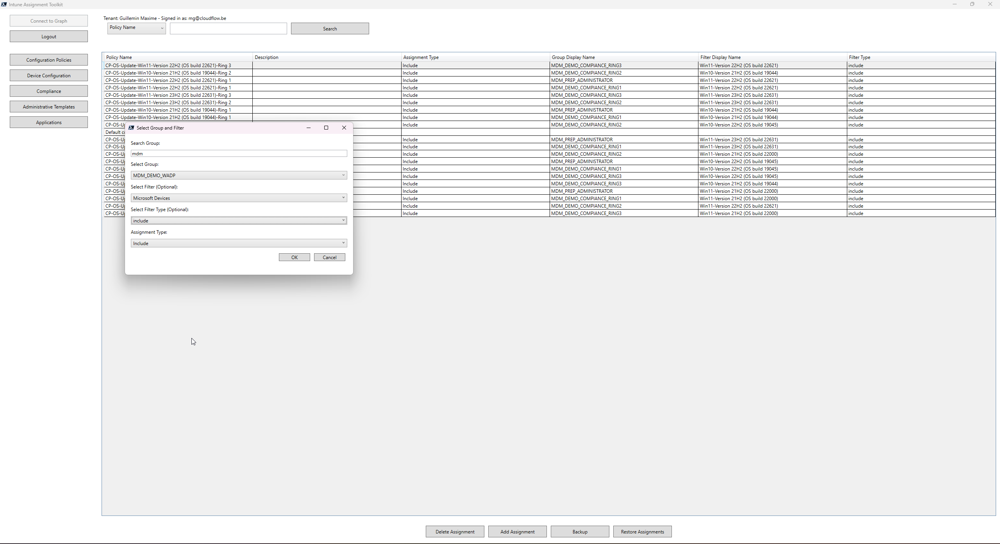

# Intune Toolkit

## Overview.

The Intune Toolkit is a PowerShell-based solution designed to simplify the management of Microsoft Intune policies. It provides a user-friendly interface for connecting to Microsoft Graph, managing policy assignments, and handling backup and restore operations for these assignments. The toolkit focuses on functionalities such as backing up and restoring policy assignments, adding or deleting assignments, and retrieving policy details (including the new device management intents) with robust error handling and detailed logging.



## Features

- **Connect to Microsoft Graph:** Authenticate with the necessary scopes.
- **Connect to Microsoft Graph With Enterprise App:** Authenticate using enterprise application credentials.
- **Tenant Information:** Display tenant details and signed-in user information.
- **Policy and App Management:** View and manage policies, apps, and device management intents with their assignments.
- **Supported Assignments:**
  - **Policies & Profiles:**
    - Settings Catalog (`configurationPolicies`)
    - Device Configuration (`deviceConfigurations`)
    - Device Compliance Policies
    - Administrative Templates
    - Endpoint Security Intents (Antivirus, Disk Encryption, etc.)
    - Windows Autopilot Deployment Profiles
    - App Configuration Policies
  - **Applications:**
    - **Windows**: Win32, MSI, Store Apps (New), WinGet, Office 365
    - **macOS**: PKG, DMG, Line-of-Business
    - **Mobile**: Android Managed Play Store, Android Enterprise, iOS Store (VPP), iOS LOB
    - **Web**: Web Links / Web Apps
  - **Scripts & Remediation:**
    - Platform Scripts (Windows)
    - Remediation Scripts (Device Health Scripts)
    - macOS Shell Scripts
    - macOS Custom Attributes
- **Assignment Management:**
  - Add and delete assignments for selected policies.
  - Search Security Groups.
  - Support for filters and installation intent.
- **Backup and Restore:**
  - Back up and restore assignments to policies and apps.
- **Export Assignments:**
  - Export assignments to CSV.
  - Document assignments to a Markdown file:
    - Selected policies/applications.
    - Bulk export of a policy type.
    - Unified reporting: HTML (interactive) and Markdown.
- **Global Group Search:**
  - Search any entra security group and see all the resources assigned to it in one view.
  - Automatically generates detailed documentation grouped by policy/resource type.
  - Visual distinction and safety locks (read-only) to prevent accidental changes during search context.
- **Advanced Policy Management:**
  - **Delete Policies:** Ability to hard delete policies (requires "Advanced Actions" toggle).
  - **Edit DisplayName & Description:** Easily edit names/descriptions for a single policy/app, or bulk rename selected items using find/replace.
- **Refresh:** Update and refresh your security groups and policies/apps.
- **Logging:** Detailed logging for all major actions and error handling.

## Prerequisites

- PowerShell 7.0 or later.
- Microsoft Graph PowerShell SDK.
- Windows Presentation Framework (WPF) for the GUI components.
- Access to Microsoft Intune with the necessary permissions.
- **Microsoft Graph Permissions:**
  - `User.Read.All`
  - `Directory.Read.All`
  - `DeviceManagementConfiguration.ReadWrite.All`
  - `DeviceManagementApps.ReadWrite.All`
  - `DeviceManagementScripts.ReadWrite.All`

## Installation

1. Clone the repository:
    ```sh
    git clone https://github.com/MG-Cloudflow/Intune-Toolkit.git
    cd Intune-Toolkit
    ```

2. Ensure you have the required assemblies and permissions to run the toolkit.

## Authentication Methods

The Intune Toolkit supports multiple authentication methods to connect to Microsoft Graph. Choose the method that best fits your organization's security requirements.

### Method 1: Interactive Authentication (Default)
**Best for:** Individual users, delegated permissions

**Setup:**
- No setup required
- Uses Microsoft's default Graph PowerShell app
- Authenticates with your user account credentials

**How to use:**
1. Click the **Connect** button
2. Sign in with your Microsoft 365 credentials
3. Consent to the requested permissions (first time only)

**Auto-reconnect:** If you don't log out, the toolkit will automatically restore your session when you reopen the app.

---

### Method 2: Custom App - Client Secret
**Best for:** Automation, unattended scripts, app-only permissions

**Azure Setup Required:**
1. Go to **Azure Portal** → **Entra ID** → **App Registrations** → **New registration**
2. Name: `Intune-Toolkit` (or your preferred name)
3. Supported account types: **Accounts in this organizational directory only**
4. Click **Register**
5. Copy the **Application (client) ID** and **Directory (tenant) ID**
6. Go to **Certificates & secrets** → **New client secret**
   - Description: `Intune-Toolkit-Secret`
   - Expiration: Choose based on your security policy
   - Click **Add** and **copy the Value immediately** (you won't be able to see it again)
7. Go to **API permissions** → **Add a permission** → **Microsoft Graph** → **Application permissions**
8. Add these permissions:
   - `User.Read.All`
   - `Directory.Read.All`
   - `DeviceManagementConfiguration.ReadWrite.All`
   - `DeviceManagementApps.ReadWrite.All`
   - `DeviceManagementManagedDevices.ReadWrite.All`
9. Click **Grant admin consent** for your tenant

**How to use:**
1. Click **Connect to Graph App**
2. Select **App Permissions - Client Secret**
3. Enter your Tenant ID, App ID, and Client Secret
4. Optionally save this configuration for future use
5. Click **Connect**

---

### Method 3: Custom App - Certificate
**Best for:** Enhanced security, no secret rotation, automated workflows

**Azure Setup Required:**
1. Follow steps 1-5 from Method 2 (App Registration)
2. **Create a self-signed certificate** (or use your organization's PKI):
   ```powershell
   $cert = New-SelfSignedCertificate -Subject "CN=Intune-Toolkit" `
       -CertStoreLocation "Cert:\CurrentUser\My" `
       -KeyExportPolicy Exportable `
       -KeySpec Signature `
       -KeyLength 2048 `
       -KeyAlgorithm RSA `
       -HashAlgorithm SHA256 `
       -NotAfter (Get-Date).AddYears(2)
   ```
3. **Export the certificate**:
   ```powershell
   $cert | Export-Certificate -FilePath "C:\Temp\IntuneToolkit.cer"
   ```
4. Go to **Certificates & secrets** → **Certificates** → **Upload certificate**
   - Upload the `.cer` file you exported
5. Go to **API permissions** and add the same permissions as Method 2
6. Click **Grant admin consent**

**How to use:**
1. Click **Connect to Graph App**
2. Select **App Permissions - Certificate**
3. Enter Tenant ID and App ID
4. Click **Browse** to select your certificate from the certificate store, or manually enter the thumbprint
5. Optionally save this configuration
6. Click **Connect**

---

### Method 4: Custom App - Interactive (Delegated)
**Best for:** Custom app with user authentication, delegated permissions, single-tenant apps

**Azure Setup Required:**
1. Follow steps 1-5 from Method 2 (App Registration)
2. **Important for single-tenant apps:** Set **Supported account types** to:
   - **Accounts in this organizational directory only** (Single tenant)
3. Go to **Authentication** → **Add a platform** → **Mobile and desktop applications**
4. Add these redirect URIs:
   - `http://localhost`
   - `http://localhost:8400`
   - `https://login.microsoftonline.com/common/oauth2/nativeclient`
   - `urn:ietf:wg:oauth:2.0:oob`
5. Under **Advanced settings**, set **Allow public client flows** to **Yes**
6. Click **Save**
7. Go to **API permissions** → **Add a permission** → **Microsoft Graph** → **Delegated permissions**
8. Add these permissions:
   - `User.Read.All`
   - `Directory.Read.All`
   - `DeviceManagementConfiguration.ReadWrite.All`
   - `DeviceManagementApps.ReadWrite.All`
   - `DeviceManagementManagedDevices.ReadWrite.All`
9. Click **Grant admin consent** (if required by your organization)

**How to use:**
1. Click **Connect to Graph App**
2. Select **Delegated Permissions - Interactive Login**
3. Enter **Tenant ID** (required for single-tenant apps)
4. Enter your custom **App ID**
5. Customize scopes if needed (defaults are provided)
6. Optionally save this configuration
7. Click **Connect**
8. Sign in with your user credentials

**Note:** Leave Tenant ID blank for multi-tenant apps.

---

### Configuration Manager

The toolkit includes a built-in configuration manager to save and load your connection settings:

- **Save Configuration:** After filling in your connection details, click **Save Configuration** and give it a name (e.g., "Production Tenant")
- **Load Configuration:** Select a saved configuration from the dropdown and click **Load**
- **Auto-naming:** Configurations are automatically tagged with their authentication method:
  - Example: `Production (Client Secret)`, `Dev Tenant (Certificate)`, `Test (Interactive)`
- **Storage:** Configurations are stored in the Windows Registry under `HKEY_CURRENT_USER\Software\IntuneToolkit\TenantConfigs` (no admin rights required)
- **Security:** Client secrets are NOT saved - you must enter them each time for security

---

## Usage

1. **Launch the Main Script:**
    ```sh
    .\Invoke-IntuneToolkit.ps1
    ```

2. **Connect to Microsoft Graph:**
    - Choose your preferred authentication method (see Authentication Methods above)
    - If you have a cached session, the toolkit will automatically connect on launch

3. **View Connection Status:**
    - The top bar displays:
      - **Line 1:** Tenant name and signed-in user
      - **Line 2:** Connected app name and App ID

3. **View Connection Status:**
    - The top bar displays:
      - **Line 1:** Tenant name and signed-in user
      - **Line 2:** Connected app name and App ID

4. **Manage Policies and Intents:**
4. **Manage Policies and Intents:**
    - Select the type of policy you want to manage (e.g., Configuration Policies, Device Compliance Policies, Mobile Applications, **Device Management Intents**, etc.) using the corresponding buttons.
    - For **Device Management Intents**, the toolkit retrieves intents along with their assignments by performing additional API calls for each intent.
    - View and manage the assignments for the selected policies.

5. **Backup Policies:**
5. **Backup Policies:**
    - Click the **Backup** button to save the current assignments of your policies to a JSON file. (Currently, only bulk backups are supported; individual policy backups will be available in future updates.)

6. **Restore Policies:**
    - Click the **Restore** button to load all assignments of the selected policy type from a backup file. (Individual policy restores will be available in future updates.)

7. **Add/Remove Assignments:**
    - Use the **Add Assignment** and **Delete Assignment** buttons to manage assignments for the selected policies.
    - You can select one or multiple policies with assignments. When you click **Add Assignment**, it will add to the existing assignments of those policies, processing them until all have been updated.
    - When adding assignments, a pop-up dialog will appear allowing you to select a security group, choose whether to include or exclude it from the policy, and apply possible filters for applications. You will also have the option to select the installation intent of the application.
    - **Remediation Script Scheduling**: When assigning device health scripts (Remediation Scripts), the dialog supports detailed scheduling configuration (Daily, Hourly, or One-time execution).
    - When you click the **Delete Assignment** button, it will delete the assignments you selected.

### New Feature: Global Group Search
1. Click the **Search Group** toggle button in the sidebar (it will turn blue).
2. Select a Security Group from the search dialog.
3. The grid will populate with **ALL** Intune resources assigned to that group (Configuration profiles, Apps, Scripts, Compliance policies, etc.).
   - A new "**Policy Type**" column helps you identify the resource category.
   - **Safety Lock**: Action buttons (Delete, Rename, Move) are automatically disabled in this view to prevent accidental changes.
4. Click **Assignment Report** to generate a comprehensive HTML or Markdown report of all assignments for that group, automatically grouped by Policy Type.

### New Feature: Delete Policy
1. Enable the **Advanced Actions** checkbox in the bottom-left corner of the sidebar.
2. The red **Delete** button will appear in the Tools panel.
3. Select one or more policies and click Delete.
4. A confirmation dialog will appear. Click the red "Delete" button to confirm the permanent removal of the resource.

## File Structure

- **Invoke-IntuneToolkit.ps1:** The main script that initializes the application, loads the UI, and imports other scripts.
- **Scripts/**: Contains all function scripts for various actions.
  - **Functions.ps1:** Contains common functions used across the toolkit.
  - **ConnectButton.ps1:** Handles the connect button click event.
  - **LogoutButton.ps1:** Handles the logout button click event.
  - **ConfigurationPoliciesButton.ps1:** Handles loading configuration policies.
  - **DeviceConfigurationButton.ps1:** Handles loading device configurations.
  - **ComplianceButton.ps1:** Handles loading compliance policies.
  - **AdminTemplatesButton.ps1:** Handles loading administrative templates.
  - **ApplicationsButton.ps1:** Handles loading applications.
  - **IntentsButton.ps1:** Handles loading device management intents. *(new)*
  - **DeleteAssignmentButton.ps1:** Handles deleting assignments.
  - **AddAssignmentButton.ps1:** Handles adding assignments.
  - **BackupButton.ps1:** Handles backing up policies.
  - **RestoreButton.ps1:** Handles restoring policies.
  - **Show-SelectionDialog.ps1:** Displays the selection dialog for groups and filters.
  - **SearchButton.ps1:** Handles search functionality.
- **XML/**: Contains XAML files for defining the UI layout.
  - **Main.xaml:** XAML file for the main window layout.
  - **SelectionDialog.xaml:** XAML file for the selection dialog layout.
- **Logs/**: Contains the log files generated during the execution of the toolkit.

## Logging

The toolkit logs all major actions and errors to `IntuneToolkit.log`. Each log entry includes a timestamp, component, context, type, thread, and file information to aid in troubleshooting and tracking activities.

## License

This project is licensed under the MIT License. See the [LICENSE](LICENSE) file for details.

## Acknowledgments

- Microsoft Graph PowerShell SDK for providing the necessary APIs to manage Intune.
